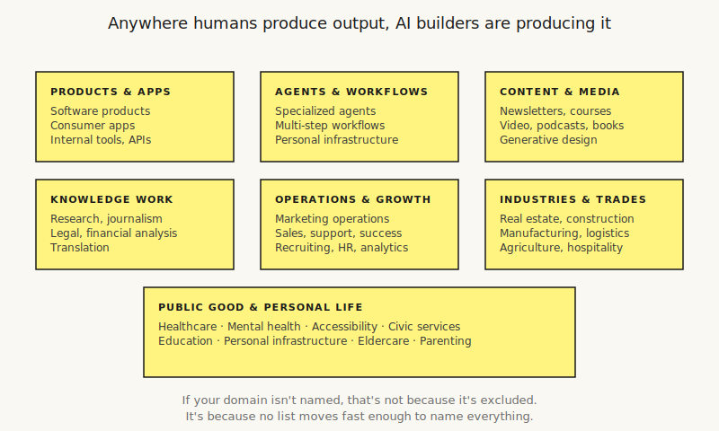
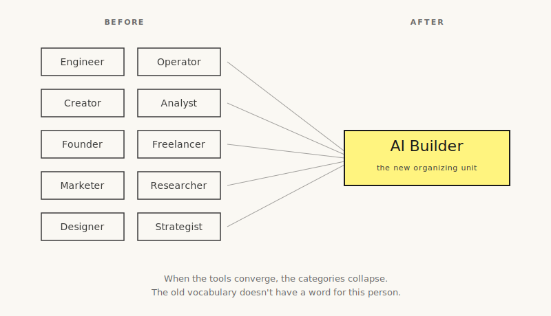

# Who is an AI builder?

An AI builder is a person who works with AI to produce quality, scalable output that helps humans or other agents get something done.

That's the definition. Read it twice. Everything else in this article unpacks what it means and why it matters that you understand it now rather than later.

## What kind of moment this is

Every few generations, the way humans produce work changes. The agricultural revolution. The printing press. Electricity. The personal computer. The internet. Each one redrew the map of who could do what, who got paid, what counted as work, who had power.

The shift happening now is bigger than any of those, and it is happening faster.

For the first time in recorded history, a single person with a laptop and an internet connection has access to a workforce. Not in metaphor. Literally. Anyone reading this can spin up agents that read documents, write code, send emails, analyze data, generate images, talk to customers, schedule meetings, do research, and execute on plans. Work that required twenty people three years ago can be done by one person now. Work that required teams of specialists can be done by generalists with good taste.

The economy is reorganizing around this fact. The jobs that don't require AI are getting rarer. The work that does require AI is getting more important. The people who know how to direct AI to produce real output are becoming the organizing unit of how things get made.

This is not a prediction. It is already happening. Small AI-native teams are outcompeting large traditional teams in every industry that tracks the data. Solo builders are outproducing small agencies. One-person research labs are publishing work that used to require institutions. Companies that were the size of cities five years ago are running on a few hundred people now and still growing revenue. The shift is visible everywhere if you know where to look.

The good news is it has barely started. The category is open. The tools are accessible. There is no waiting list. The only question is whether you decide to be part of it or stand to the side and watch.

## The shape of the work

An AI builder interacts with models. They prompt with skill, verify the output, and ship what they make. They treat AI as a coworker they direct, not a search engine they query. They know which model to use for which job. They know what to automate and what to hold onto themselves. They pay attention to the difference between AI doing something and AI doing something well.

The output has to work. AI makes bad output free to produce, which means the world now has more bad output than it has ever had. A builder is someone whose output survives that flood, because it is useful, because it is accurate, because it is made with care. Quality is the line between building and noise.

The output has to scale. One-off work is fine. Building isn't about one-off work. The point of working with AI is that agents handle the scaling, and the builder's job is to design systems that keep producing. A builder's output gets better as it runs longer, not just as they spend more hours on it.

That's the work. Direct AI well. Verify what comes back. Build systems that compound. Ship.

## What AI builders build

The work is wider than most people realize. AI builders are producing in nearly every domain humans have ever produced in. The list below is not exhaustive. It is where the work is happening today.

**Products and applications.** Software products that compete with what funded teams used to build. Consumer apps. Mobile apps. Browser extensions. Developer tools. APIs that other builders pay to use. Internal tools that disappear inside companies and make small teams outproduce large ones. Data products: structured datasets, search indexes, embeddings, machine-readable corpuses sold as standalone products.

**Agents and workflows.** Specialized agents that handle one job end to end. Multi-step workflows that orchestrate dozens of tools. Customer support agents. Sales qualification agents. Research agents that pull from a hundred sources and write a brief. Personal agents that run someone's inbox, calendar, and daily life. Trading and financial agents that manage portfolios. Hardware agents that control physical systems, IoT devices, and robotics.

**Content and media.** Essays. Newsletters. Video production. Podcast pipelines. Courses. Books. Documentary research. Music production. Generative design systems. Brand asset pipelines. Image and video editing automation. Interactive narratives and games. Procedural content for entertainment.

**Knowledge work.** Research that gets published. Academic literature reviews. Scientific hypothesis generation. Investigative journalism. Fact-checking systems. Legal research and contract review. Compliance monitoring. Tax preparation and accounting. Financial analysis. Market intelligence. Patent analysis. Translation and localization across languages and cultures.

**Operations and growth.** Marketing operations that let one person run what used to be a department: landing pages, ad creative, copywriting at scale, SEO content production, email sequences, social media systems. Sales operations. Onboarding flows. Customer success. Analytics dashboards. Knowledge bases. Community management. Recruiting tools. HR automation.

**Industries and trades.** Real estate analysis and lease management. Construction planning and supply chain. Manufacturing and logistics optimization. Agriculture and farm operations. Hospitality and restaurant systems. Insurance underwriting and claims. Energy management. Retail operations and inventory. Professional services delivery.

**Public good and personal life.** Healthcare applications: symptom triage, mental health support, fitness coaching, nutrition planning, medication management. Accessibility tools that help people access information and interfaces they previously could not. Civic services that help people navigate bureaucracy and access government benefits. Educational tools for K-12, university, and lifelong learning. Personal infrastructure: second-brain systems, journaling, life management. Tools for elderly care, parenting, household operations.

The list keeps expanding because the work keeps expanding. Anywhere humans produce output, AI builders are now producing it differently. If your domain isn't named above, that is not because it is excluded. It is because no list can move fast enough to name everything.

## Why the category is new

For most of history, the gate between an employee and a founder was capital, credentials, and access to talent. You needed money. You needed the right team. You needed a story that raised more money. The job was the default. The company was the exception.

Agents do the scaling now. The software product that needed twenty people three years ago can be shipped by three or by one with good taste. The marketing department is a Claude prompt and a cron job. The customer support team is a specialized agent with a well-written system prompt and a human at the edges. The research analyst is a workflow that reads from twelve sources and writes a brief in ninety seconds. The content studio is one person directing models to produce work people read.

The AI builder is what happens when the categories collapse. They are not an employee in the old sense, because the employer relationship is optional. They are not a founder in the old sense, because many builders don't run companies, they run output. They are not a freelancer, because freelancing was trading time for money and builders are building leverage.

The old vocabulary doesn't have a word for this person. AI builder is the word.

## Who becomes one

Anyone can. That sentence does the work the rest of this article exists to support.

A person who lost their job to automation and decided to use the same tools to build something new. A recent graduate who skipped the traditional career ladder and started shipping a product in month one. A thirty-year veteran of a collapsing industry who knows more about their domain than anyone and is now using AI to build what their old employer never would. A parent working from a kitchen table who wants income that doesn't require a commute. A nurse who is tired of the system and is building tools to help patients navigate it. A teacher building a course business that reaches students their classroom never could. A farmer in a small town optimizing operations no consultant would ever fly out for. A researcher in a country where the old career paths never existed and the new ones do not care where you live.

None of these people need anyone's approval to become a builder. They need to learn the tools, work with them seriously, and start producing.

This is the part most definitions miss. Builder has historically come with implicit requirements: the right background, the right network, the right location, the right capital. AI builders do not carry those requirements forward. The category is wider because the barrier is lower.

That doesn't mean it is easy. Knowing AI takes real work. Producing quality output takes real work. Shipping consistently takes real work. But the work is available to anyone willing to do it, which was not true of the old categories.

## What it takes

You need to know AI. Not in the academic sense of reading every paper. In the working sense of being able to get real output from the tools available today. Know how to prompt. Know which model handles which kind of task well. Know what to verify, because confidently wrong output is the default failure mode and verification is part of the work. Know how to chain steps so the output compounds. Know what to automate and what you handle yourself.

You need to work with AI. That phrase is doing work. It means building the relationship: giving the model context, giving it taste, giving it the constraints that produce good output. It means iterating on prompts the way a manager iterates on briefs. It means treating AI as something you work alongside, not something you poke at.

You need to ship. Start something, finish it, put it in front of someone who is not you. This is the part most people skip, and it is the part that separates everything. The loop from idea to output has never been shorter. The builders are the ones who use the short loop repeatedly.

Nothing else is required. Not a degree. Not a fundraising round. Not a specific city. Not permission from anyone. The tools are available. The models are accessible. The documentation is free. The gate is whether you use them.

## What it produces

An AI builder's output ranges from making a living to building generational wealth. Both are real. The distance between them is what the builder chooses to work on, how well they choose it, how hard they work, and how long they stay at it.

Some builders use AI to replace a salary. They ship one product that earns what a job used to pay and never go back to employment. Some build a portfolio of small products, each earning a modest amount, that collectively exceed what any single job ever could. Some aim bigger and build companies that employ other people, which is the path that used to require funding and now increasingly does not. Some build audiences, publishing work that reaches millions and produces income through the audience itself. Some build specialized tools that a few large customers pay for. Some build public research that changes an industry.

All of it is building. The range of outcomes is wide because the work is wide.

## Why this is not optional

There has always been a temptation to wait. To watch the new thing for a few years. To see if it becomes real before committing time to it. To let other people figure it out and join when the path is clear.

That instinct is a luxury that worked in earlier transitions because earlier transitions moved slowly enough for late entrants to catch up. The internet took ten years to reorganize the economy. Mobile took five. AI is moving faster than either, and the gap between early builders and late entrants is widening every quarter.

The economy is already splitting into two groups. People who direct AI to produce output and people who consume what others produce with AI. The first group is becoming the new middle class and the new wealthy. The second group is becoming customers and audiences for the first group's work.

Neither role is wrong. But there will be far fewer jobs in the traditional sense for either of them. The job, as a category, is shrinking. What replaces it is building.

If you are reading this and you do not yet build, you have a window. The window is not closing. It will not close. But the people who walk through it now will have a permanent head start over people who walk through it later. Compounding does not pause to wait for the late arrivals.

## Five places to start

You don't need to know which one is right. Pick the one that fits where you already are.

**1. Build an agent that handles your inbox.** Almost everyone has too much email. An agent that reads incoming mail, sorts by priority, drafts replies for the high-priority ones, and presents you with a daily review queue is a project anyone can ship in a weekend. You'll learn how to give an agent context, how to verify its output before anything sends, and how to design a system that runs forever after you build it. The output is your own inbox suddenly being bearable. The skill you learn applies to every agent you build after.

**2. Build a small content engine in a domain you know.** Pick a topic you have real knowledge of. Build a system that produces one piece of useful content per week: a newsletter, a research brief, a thread, a video script. The system reads sources, drafts in your voice, and presents drafts for your review before publishing. You become a content operator with a system that compounds. Skip this one if you have no audience-building interest. Take this one if you do.

**3. Automate the worst recurring task at your job.** Find the task at work that drains you. Build the tool that does most of it. Could be a script, a Notion automation, a specialized agent that runs on a schedule. Show your team what you built. You'll get hours of your week back and you'll demonstrate the multiplier effect to people who haven't seen it yet. The first builder inside a company often becomes indispensable to it.

**4. Ship a small product that solves your own problem.** Find something that bothers you in your daily life. Build the smallest possible solution to it. Could be a web app, a browser extension, a mobile shortcut, an API. Doesn't need to be venture scale. Doesn't need to be a business. It needs to be live, working, and useful to at least you. Send the URL to ten friends. Some will use it. You will have built a real product.

**5. Build a research system in a topic you want to understand deeply.** Pick a domain you want to know cold. Build a system that monitors the relevant sources, summarizes new developments, and produces briefs you actually read. Could be a market, a technology, a policy area, a competitor set. You become the most informed person in your circle on that topic, and you have a reusable system you can apply to the next topic later. This is how analysts and journalists are quietly becoming the most leveraged people in their fields.

Each of these is small enough to ship in your first week of trying. None of them require capital, credentials, or permission. All of them teach the working pattern that scales to whatever you build next.

The point isn't to do all five. Pick the one that fits where you already are and start there tonight.

## Start

The tools cost almost nothing. The time cost is real but available to anyone who decides it is worth it. The barrier you are imagining is smaller than you think.

This is the moment. The category is open. The tools are ready. Every person reading this can become a builder.

The only question is what you build.
